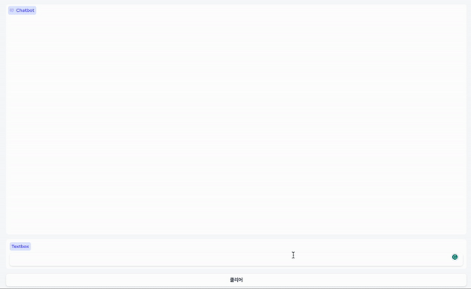

<p align="center" width="100%">

</p>


# Llama2 Code Interpreter

This project allows LLM to generate code, execute it, receive feedback, debug, and answer questions based on the whole process. It is designed to be intuitive and versatile, capable of dealing with multiple languages and frameworks.

[The purpose and direction of the project](https://github.com/SeungyounShin/Llama2-Code-Interpreter/wiki)

## 🌟 Key Features

- [x] 🚀 **Code Generation and Execution**: Llama2 is capable of generating code, which it then automatically identifies and executes within its generated code blocks.
- [x] Monitors and retains Python variables that were used in previously executed code blocks.
- [ ] 🌟 At the moment, my focus is on "Data development for GPT-4 code interpretation" and "Enhancing the model using this data". For more details, check out the [feat/finetuning branch](https://github.com/SeungyounShin/Llama2-Code-Interpreter/tree/feat/finetuning) in our repository.
- [ ] 🌟 CodeLlama Support [CodeLlama2](https://github.com/facebookresearch/codellama)


## Examples


---
<div align="center">

***Llama2 in Action***

<p align="center" width="100%">

</p>

</div>

In the GIF, Llama2 is seen in action. A user types in the request: `Plot Nvidia 90 days chart.` Llama2, an advanced code interpreter fine-tuned on a select dataset, swiftly queries `Yahoo Finance`. Moments later, it fetches the latest Nvidia stock prices from the past 90 days. Using `Matplotlib`, Llama2 then generates a clear and detailed stock price chart for Nvidia, showcasing its performance over the given period.


## Installation

1. Clone the repository:
```bash
git clone https://github.com/SeungyounShin/Llama2-Code-Interpreter.git
```

2. Change directory:
```bash
cd Llama2-Code-Interpreter.git
```

3. Install the required dependencies:
```bash
pip install -r requirements.txt
```

I see, you want to include the part about setting the `LLAMA_CI_PATH` environment variable in the setup instructions. Here's how you might write it:

### Setup

**Set the `LLAMA_CI_PATH` environment variable:** This script requires the `LLAMA_CI_PATH` environment variable to be set to the directory that contains the relevant code. You can set it to the current directory like this:

```bash
export LLAMA_CI_PATH=$(pwd)
```

Please note that this setting is only valid for the current shell session. If you want to make it permanent, you can add it to your shell's startup file (like `.bashrc` or `.bash_profile`).

### Run App

To start interacting with Llama2 via the Gradio UI:

```bash
python3 chatbot.py --model_path <your-model-path>
```

Replace `<your-model-path>` with the path to the model file you want to use. (Usally I recommend you to use chat-type model e.g. `meta-llama/Llama-2-13b-chat`)

Please let me know if you need help with a specific part of this setup process.

## Contributions

Contributions, issues, and feature requests are welcome! Feel free to check [issues page](https://github.com/SeungyounShin/Llama2-Code-Interpreter/issues). 

## License

Distributed under the MIT License. See `LICENSE` for more information.

## Contact

Seungyoun, Shin - 2022021568@korea.ac.kr

## Acknowledgement

Here are some relevant and related projects that have contributed to the development of this work:

1. **llama2** : [GitHub Repository](https://github.com/facebookresearch/llama)
2. **yet-another-gpt-tutorial** : [GitHub Repository](https://github.com/sjchoi86/yet-another-gpt-tutorial/tree/main)

These projects have been instrumental in providing valuable insights and resources, and their contributions are highly appreciated.

---
